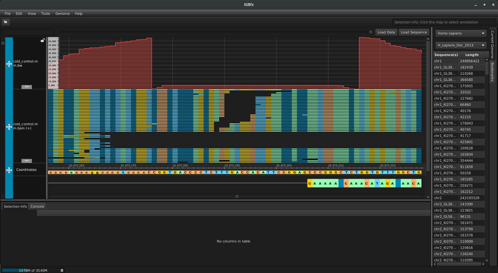
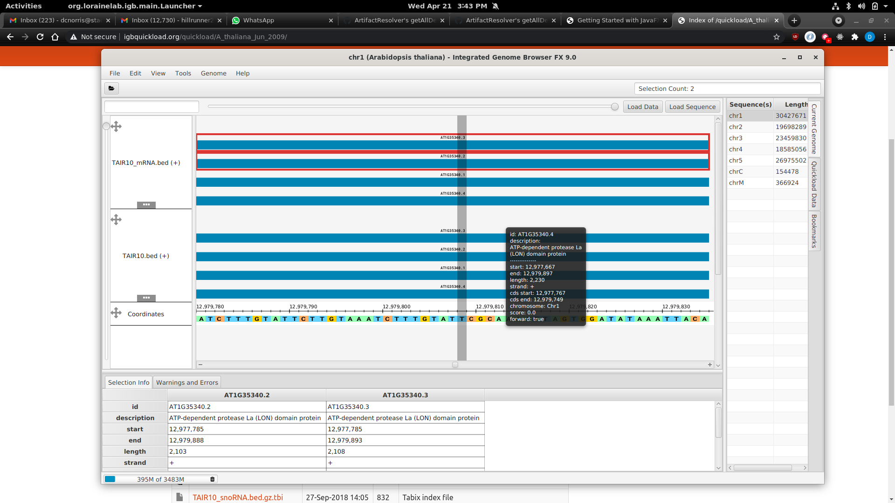

# IGB-FX - Integrated Genome Browser JavaFX edition

The Integrated Genome Browser (IGB) is a fast, free, and flexible desktop genome browser
implemented in Java.

Here, we are re-writing IGB using JavaFX and 100% modular, services based programming with OSGi.

IGB-FX replaces IGB Classic, which uses Swing and was first developed
at Affymetrix in the early 2000s. The last version of [IGB Classic](https://bitbucket.org/lorainelab/integrated-genome-browser) is
IGB version 9, released in June 2016.

***

# Quick Start 

Install maven build tool and Apache karaf OSGi container.

To build and run IGB-FX:

1. Clone this repository
2. Build IGB using mvn
3. Launch IGB using start-shell.sh
4. View some data - open human genome.

Ex)

```
clone git@bitbucket.org:lorainelab/igb-fx.git
mvn clean install
start-shell.sh
```

***

# Screenshots



# About IGB-FX

Like IGB classic, IGB-FX IGB runs in an OSGi container, which supports adding and removing pluggable Apps while IGB is running. 
For a tutorial on OSGi written by IGB Developers, see: 

* Stackleader.com [blog posts on OSGI](https://blog.stackleader.com/tags/osgi/)

*** 

# To contribute

Use fork-and-branch workflow:

1. Fork the [team repository](http://www.bitbucket.org/lorainelab/igb-fx).
2. Create branches specific to the changes you want to make, push to your fork.
3. Issue pull requests to the team repository's master branch.

See:

* Forking Workflow [tutorial](https://www.atlassian.com/git/tutorials/comparing-workflows/forking-workflow) by Atlassian
* Blog post titled [Using the Fork-and-Branch Git Workflow](http://blog.scottlowe.org/2015/01/27/using-fork-branch-git-workflow/)
